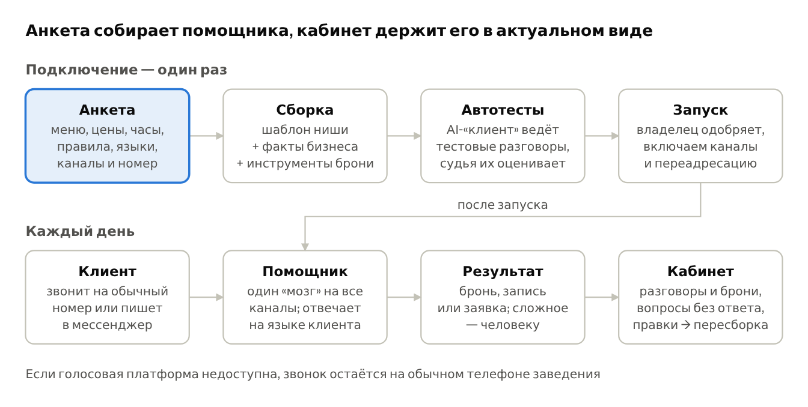
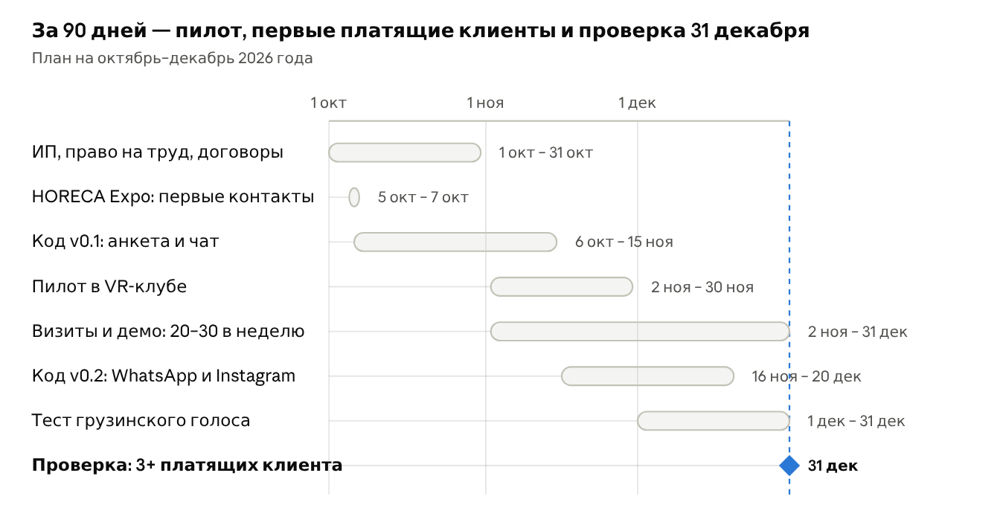

# Концепция AI-помощника

Oct 1, 2026 · @Daniel · версия 2

> Текстовая копия концепции владельца проекта (docx, версия 2). По ней строится
> бэкенд. Отклонения реализации от этого текста описаны в `docs/architecture.md`.

AI-помощник отвечает клиентам ресторанов, отелей, кафе и VR-клубов круглосуточно, на их языке, записывает и бронирует, а сложное передаёт человеку — по подписке 150–200 € в месяц за одного «сотрудника». Ниже — как это устроено и сколько реально приносит.

## Коротко

Мы продаём бизнесам AI-сотрудника первой линии. Он отвечает на звонки и сообщения круглосуточно, на языке клиента, записывает, бронирует и собирает заявки, а сложное передаёт человеку. Бизнес заполняет анкету, и ассистент собирается сам — без ручной настройки под каждого клиента.

| Что | Как |
| --- | --- |
| Кому | Всем, кому звонят и пишут, чтобы записаться, забронировать или спросить: рестораны и кафе, отели и гостевые дома, VR и развлечения, салоны, клиники, автосервисы, прокат авто, туры, школы, магазины в Instagram. Полный список — в разделе «Сценарии по нишам» |
| Каналы | Телефон (номер заведения остаётся прежним), WhatsApp, Instagram, Messenger, Telegram, чат на сайте; Viber — во второй версии |
| Языки | На старте грузинский, русский и английский; турецкий, иврит, арабский и армянский — по запросу |
| Цена в месяц | «Чат» — 99 € (293 ₾), «Голос + чат» — 175 € (517 ₾), «Плюс» — 349 € (1 031 ₾); подключение — 150 € |
| Себестоимость | Базовый тариф «Голос + чат» стоит нам ≈ 55 € в месяц (54,9 €); валовая маржа — 68,6 % |
| Вложения | ≈ 1 500 € на старте: юрист, тестовые минуты и номера, ИП и право на труд, материалы для продаж |

Главное о деньгах:

- 15 клиентов × 200 € = 3 000 € — это выручка, а не прибыль. После себестоимости, постоянных расходов и налога остаётся 1 631 € в месяц, при цене 175 € — 1 323 €.
- Для 4 000 € чистыми в месяц нужно 48 клиентов, для 3 000 € — 32, для 10 000 € — 120.
- Базовый сценарий: к 24-му месяцу (октябрь 2028) — 52 клиента и 4 816 € чистыми в месяц. 4 000 € набирается с 19-го месяца, вложения окупаются на 6-м. Худший сценарий даёт 2 209 €, лучший — 9 275 €.
- «Ничего особо не делая» не получится. 15 клиентов — это 5–10 часов в неделю даже с автоматизацией, 30 клиентов — 10–19 часов.

Почему это может сработать в Грузии:

- Администратор получает ≈ 1 200 ₾ в месяц на руки (разбор 135 вакансий на jobs.ge, 01.10.2026). Ассистент за 517 ₾ работает 24/7 и на нескольких языках.
- Прямой местный конкурент — aiNOW: чат за 220–2 500 ₾ и отдельный голосовой агент aiCALL за 220–5 000 ₾. Ценой от него не отличиться. Отличаемся одним помощником на все каналы вместе с телефоном, языками туристов, готовыми сценариями ниш и отчётом о пропущенных обращениях (раздел «Конкуренты»).
- В 11 подходящих нишах 16 100 действующих бизнесов, из них 9 707 — в Тбилиси, Батуми и Кутаиси (бизнес-регистр Geostat).

Три условия, без которых не запускаемся:

- Проверить голос на грузинском на реальных звонках пилота.
- Обрабатывать данные в ЕС и подписать с каждым клиентом договор обработки данных.
- Продавать услугу — приём звонков и запись клиентов, а не «лицензию на ПО». Иначе не работает налог 1 %.

Все суммы — в евро по курсу НБГ на 30.09.2026 (1 € = 2,9552 ₾), если не указано иное. Расчёт — модель model_ai (01.10.2026).

## Проблема: клиент уходит, когда ему не ответили

Бизнес теряет клиентов не из-за плохого продукта, а потому, что в нужный момент никто не ответил. Трубку не взяли, на сообщение ответили на следующий день, гостю ответили не на его языке или грубо. Это и есть «человеческий фактор», за устранение которого бизнес готов платить.

| Что происходит | Цифры | Источник |
| --- | --- | --- |
| Не берут трубку: рестораны | Фастфуд пропускает 40,1 % звонков, fast casual — 24,8 %, рестораны с обслуживанием — 9,0 %; разобрано 12 091 запись звонков | Revmo через F&B Magazine, 21.08.2026 (данные вендора) |
| Не берут трубку: бизнес в среднем | 28 % звонков остаются без ответа | CallRail, 28.07.2026 (данные вендора) |
| Салоны: звонят не вовремя | 37 % звонков без ответа; 34 % запросов на запись приходят в нерабочее время | Zenoti, 06.12.2025 (данные вендора) |
| Клиники: не дождались | 31 из 100 звонящих в стоматологию кладут трубку, не дождавшись сотрудника (11,5 млн звонков за 2025 год) | Patient Prism, 02.07.2026 (данные вендора) |
| Клиент уходит к другим | 69 % взрослых в США скорее откажутся от ресторана, если там не берут трубку (опрос 2 065 человек) | Hostie + The Harris Poll, 2025 |
| Отвечают поздно | Те, кто отвечает на заявку в течение часа, доводят её до разговора почти в 7 раз чаще; ответ через 30 минут вместо 5 снижает шансы в 21 раз | HBR, 2011; Lead Response Management Study, 2007 |
| Говорят не на том языке | 76 % покупателей предпочитают информацию на родном языке, 40 % никогда не покупают на сайтах на других языках (8 709 человек, 29 стран) | CSA Research, 2020 |
| Грубость попадает в отзывы | +1 звезда на Yelp даёт независимому ресторану +5–9 % выручки; +1 балл оценки позволяет отелю поднять цену на 11,2 % | HBS; Cornell через Hospitality Net, 2012 |

### Что известно про Грузию

- Персонала не хватает. Всемирный банк пишет, что качество сервиса «не дотягивает до международных стандартов» из-за нехватки работников, а также навыков сервиса и языков (World Bank, 05.2024). Нехватка администраторов, официантов и поваров — вызов № 1 туризма на 2026 год (IBN, 29.10.2025).
- Один человек на смену. Типичный график ресепшн — «сутки через двое» (jobs.ge). В зале единоборств администратор за 700 ₾ одновременно отвечает на входящие звонки (jobs.ge).
- Языков не хватает. Английский требуют в 71 % объявлений администраторов, русский — в 44 %, а турецкий, иврит или арабский — ни в одном из 135. При этом в 2025 году 16,0 % поездок в Грузию пришлось на Турцию, 5,2 % — на Израиль (GNTA, 2025).
- Гости в целом довольны: 93,7 % иностранцев удовлетворены поездкой (GNTA, 2025). Поэтому продаём не «ваш персонал плохой», а «вы не теряете брони ночью, в пик и на чужом языке».

### Сколько стоит одна потерянная бронь

- Отель в Тбилиси: средняя цена номера в I квартале 2026 года — $89 (Kedaro / G&T). Одна потерянная бронь на 2 ночи ≈ 157 € — почти месячная цена ассистента.
- Ресторан: ужин на двоих в заведении среднего уровня ≈ 100 ₾ (Numbeo, 28.09.2026). Чтобы вернуть 517 ₾ подписки выручкой, достаточно ≈ 5 сохранённых ужинов в месяц.

### Честно о данных

Почти все цифры о пропущенных звонках — из США и от компаний, которые продают решение. Грузинских замеров нет, а часто цитируемые «28 % пропущенных звонков в отелях» восходят к блогу без источников. Поэтому каждый пилот начинается с аудита пропущенных обращений за 1–2 недели: сколько звонков не взяли и сколько сообщений ждали ответа дольше часа. Эти цифры клиента — лучший аргумент в продаже.

## Решение: AI-сотрудник на первой линии

AI-помощник работает как администратор, который никогда не уходит со смены. Он отвечает за секунды, в любое время, на языке клиента, и доводит разговор до брони, записи или заявки. Сложное и спорное он не решает сам — передаёт человеку со сводкой разговора.

| Что делает | Как это выглядит для клиента и владельца |
| --- | --- |
| Отвечает на звонки и сообщения | Телефон, WhatsApp, Instagram, Messenger, Telegram, чат на сайте — один «мозг» во всех каналах |
| Говорит на языке клиента | Языки выбирает бизнес; помощник переключается по первой фразе клиента. Голос на грузинском проверяется отдельно — раздел «Технологии» |
| Записывает и бронирует | Стол на время, номер на даты, слот в VR-зале, мастер в салоне — с подтверждением и напоминанием |
| Знает меню, цены и правила | Берёт их из анкеты бизнеса. Чего нет в анкете, не выдумывает, а обещает уточнить |
| Собирает заявки | Банкет, корпоратив, групповой заезд: имя, телефон, дата, бюджет — сразу менеджеру |
| Передаёт человеку | Жалоба, VIP-гость, нестандартная просьба — менеджеру в WhatsApp или Telegram, с кратким пересказом |
| Не грубит и не устаёт | Одинаково вежлив в 14:00 и в 02:00, в сотом разговоре за день так же, как в первом |
| Отчитывается владельцу | Кабинет: сколько разговоров, броней и заявок, какие вопросы остались без ответа |

Помощник всегда представляется AI-ассистентом. Так честнее перед клиентом и безопаснее для бизнеса по требованиям к прозрачности.

## Сценарии по нишам: куда ставить помощника

Помощник нужен везде, где клиенты звонят и пишут с одними и теми же вопросами, а бронь, запись или заявка теряется, если не ответить сразу. Ресторанами и отелями дело не ограничивается: в таблице — 16 ниш, и все они работают на одной платформе.

Ниша подходит, если выполнены три условия:

- Много входящих обращений с повторяющимися вопросами.
- Каждое обращение — это деньги: бронь, запись, заказ или заявка.
- Ночью, в пик или на иностранном языке ответить некому.

| Ниша | Действующих в Грузии | Что делает помощник | Тариф и интеграции | Очередь |
| --- | --- | --- | --- | --- |
| Рестораны и кафе | 5 928 (Тбилиси 2 372, Батуми 852) + бары 402 | Бронь стола, часы и меню, заявки на банкет и день рождения, отмена и перенос, ссылка на доставку. Про аллергены — только из анкеты | «Голос + чат»; календарь броней, позже Poster и Loyverse | A |
| Отели, гостевые дома, хостелы | 2 680 + 306 | Свободные номера и цены на даты, прямая бронь без комиссии Booking.com (18–20 % у гостевых домов), трансфер, ранний заезд, вопросы гостей 24/7 на 5+ языках | «Голос + чат» или «Плюс»; PMS с API: Cloudbeds, Mews, HotelRunner | A |
| VR, квесты, игровые и детские центры | 438 (Тбилиси 265) + парки 147 | Свободные слоты, дни рождения и корпоративы (пакеты, предоплата), возраст и правила | «Чат» или «Голос + чат»; Google Calendar, Cal.com | A, первый пилот |
| Салоны, барбершопы, СПА | 3 458 + СПА 426 | Запись к мастеру, перенос, цены услуг, напоминания (меньше неявок) | «Чат»; Google Calendar или Cal.com (у грузинских сервисов записи публичных API нет) | A |
| Стоматологии и частные клиники | 1 442 + врачи и прочая медицина 1 417 | Запись к врачу, цены, подготовка к приёму, адрес. Медицинских советов не даёт, срочное сразу передаёт человеку | «Голос + чат»; календарь врачей | B: сначала юрист (данные о здоровье) |
| Фитнес, ММА и единоборства, падел | 191 (код 93.13) + часть залов в других кодах | Пробная тренировка, расписание, абонементы, заморозка, аренда корта | «Чат»; календарь | B |
| Квартиры посуточно | 16 526 объявлений Airbnb (GNTA, июнь 2026) | Вопросы до брони, инструкция по заселению, Wi-Fi, правила, продление — на языке гостя | «Чат» для хоста с несколькими квартирами; WhatsApp | B |
| Автосервисы, шиномонтаж, мойки | не считали | Запись на время, цены «от», что взять с собой; статус ремонта — во второй версии | «Голос + чат»; календарь | B |
| Прокат авто, трансферы, туры | не считали | Наличие и цены на даты, бронь с предоплатой по ссылке, вопросы туристов на их языке | «Чат» или «Голос + чат» | B |
| Банкетные залы, свадебные площадки, кейтеринг | кейтеринг 222; залы не считали | Заявка: дата, число гостей, бюджет, меню — сразу менеджеру; свободные даты | «Чат» или «Голос + чат» | B |
| Недвижимость и застройщики | не считали | Квалификация заявок 24/7 (бюджет, район, срок, рассрочка), запись на показ, ответы иностранцам | «Плюс»; CRM или таблица лидов | B: высокий чек |
| Школы, курсы, кружки, автошколы | не считали | Пробное занятие, расписание, цены, запись, напоминания об оплате | «Чат» | C |
| Магазины в Instagram и интернет-магазины | не считали | Наличие, размеры, доставка, статус заказа, оформление заказа с передачей менеджеру | «Чат»; каталог из таблицы | C |
| Ветклиники и груминг | не считали | Запись, цены, срочное — сразу врачу | «Голос + чат» | C |
| Услуги на дому: клининг, ремонт, мастера | не считали | Расчёт по прайсу, запись на время, адрес и фото задачи | «Чат» | C |
| B2B: стройматериалы и мебель (в том числе наш мебельный бизнес) | не считали | Каталог, цены «от», расчёт доставки, заявки с объёмами — менеджеру | «Чат» | C, для себя |

Цифры — действующие субъекты бизнес-регистра Geostat по основному коду деятельности на 01.10.2026. Ниши «не считали» в этом исследовании не измерялись; их размер проверяем перед продажами.

### Одна платформа для всех ниш

У всех ниш одинаковый набор «навыков» помощника:

- ответ на вопрос из базы фактов бизнеса;
- проверка свободного времени и бронь;
- заявка менеджеру;
- передача человеку;
- напоминание;
- ссылка на оплату.

Ниша меняет только три вещи: вопросы анкеты, что именно бронируется (стол, номер, мастер, слот, показ) и правила передачи человеку. В коде это нишевой шаблон (раздел «Техническое задание»). Новая ниша — это новый шаблон за 1–2 дня, а не новый продукт.

### Куда не ставим

- Медицинские, юридические и финансовые консультации — только запись на приём. Экстренные случаи всегда уходят человеку или на 112.
- Холодные исходящие звонки с рекламой — другая юридическая зона; на старте делаем только входящие и напоминания о записи.
- Универсальный AI-бот «обо всём» в WhatsApp Meta запретила с 15.01.2026 (TechCrunch). Наш помощник всегда отвечает только про свой бизнес.
- Интеграции с российскими системами (iiko, r_keeper, TravelLine, Bnovo) не делаем: Даня — гражданин США. Заведения на них получают помощника с нашим календарём.

### С чего начинать

Первая волна — ниши A:

- VR и развлечения: через знакомых с VR-комплексом можно запустить пилот за недели;
- рестораны и отели с туристами: там больше всего звонков и языков;
- салоны: массовая ниша для дешёвого тарифа «Чат».

Клиники берём после консультации юриста по данным о здоровье. Ниши B и C открываем шаблонами, когда есть первый клиент из ниши.

## Как устроен продукт

Продукт состоит из двух частей. Первая — конвейер, который собирает помощника из анкеты. Вторая — сам помощник, который каждый день отвечает клиентам во всех каналах. Владелец видит всё в кабинете и сам правит меню, цены и часы — без нас.



Автоматическая сборка из анкеты уже есть в прототипе «Мастерская ассистентов»: анкета, сборка и тестовый чат. Код первой версии повторяет его логику на настоящих каналах.

### Путь владельца: от анкеты до запуска

- Регистрация. Владелец входит по номеру телефона или почте, выбирает нишу и языки.
- Анкета. Часы и адрес, меню или услуги с ценами, правила брони, частые вопросы, кому передавать сложное, каналы. Меню можно загрузить фото, PDF или ссылкой — модель сама разложит его по полям. Цель продукта — анкета не дольше 20 минут.
- Сборка. Анкета превращается в профиль бизнеса — таблицу фактов. К ней добавляется шаблон ниши и инструменты: календарь, заявка, передача человеку. Из этого создаются текстовый и голосовой агент.
- Автотесты. AI-«клиент» проводит набор тестовых разговоров на всех выбранных языках: бронь, отмена, вопрос о цене, вопрос, которого нет в анкете, грубый клиент, просьба позвать человека. Второй AI — «судья» — проверяет, не выдумана ли цена, верно ли создана бронь и передан ли разговор человеку.
- Проверка владельцем. Владелец получает список «что дописать» — вопросы, на которые в анкете нет ответа. Он может сам позвонить и написать своему помощнику прямо из кабинета.
- Запуск. Подключаем каналы: Instagram и Messenger — входом через Facebook, WhatsApp — номером бизнеса, Telegram — ботом, сайт — одной строкой кода. На номере заведения включаем переадресацию «нет ответа / занято» на наш номер +995.

### Путь клиента заведения

- Звонок. Клиент звонит на привычный номер. Если администратор не взял трубку, занят или сейчас ночь, звонок уходит помощнику. Тот сразу говорит, что он AI-ассистент заведения, что разговор записывается и как позвать человека.
- Сообщение. Клиент пишет в Instagram, WhatsApp, Messenger, Telegram или чат на сайте и получает ответ за секунды.
- Разговор. Помощник определяет язык по первой фразе и отвечает только из таблицы фактов. Он проверяет свободное время, создаёт бронь, вслух повторяет дату, время и имя, присылает подтверждение и напоминание.
- Передача человеку. Вопрос не из анкеты, жалоба или просьба позвать человека — помощник не импровизирует. Менеджер получает в Telegram или WhatsApp короткий пересказ и контакт клиента. В рабочее время звонок можно перевести на мобильный сотрудника, в нерабочее — пообещать ответ утром.

### Что видит владелец в кабинете

- Ленту разговоров с расшифровкой и записью звонка.
- Брони и заявки со статусами.
- «Вопросы без ответа» с кнопкой «добавить ответ»: после неё помощник пересобирается и проходит автотесты.
- Статистику: обращения, брони, доля обращений вне рабочего времени, языки, передачи человеку.
- Настройки (часы, меню, цены, кому передавать, каналы), тариф и счета.

### Почему это масштабируется без ручной работы

- Знания бизнеса живут в анкете и таблице фактов, а не в тексте инструкции. Новая цена не требует нас.
- Шаблоны ниш общие: исправление в шаблоне улучшает помощников всех клиентов ниши.
- Автотесты прогоняются при каждой правке, поэтому сломанная версия не доходит до клиентов.
- Ручная работа остаётся в трёх местах: продажи, проверка первой анкеты и разбор неудачных разговоров. См. раздел «Работа после запуска».

## Технологии и себестоимость

Помощника собираем из готовых сервисов, а не пишем свой голосовой движок. Так один человек запускает продукт за недели. Клиент на базовом тарифе стоит нам ≈ 55 € в месяц, и почти половина этой суммы — минуты голоса. Цены проверены 01.10.2026.

### Стек

| Задача | Выбор | Почему | Цена |
| --- | --- | --- | --- |
| Голос: распознавание, синтез, ведение разговора | ElevenLabs Agents | Говорит по-грузински, есть готовое подключение к WhatsApp и телефонии по SIP | $0,08 за минуту + модель |
| Запасной голос | Vapi + распознавание Azure или Deepgram | Модульная платформа, готовая инструкция для номеров Zadarma | 1 000 минут — $82–129 |
| Модель (мозг) | OpenAI gpt-5-mini, данные хранятся в ЕС | Дёшево и быстро; хранение в ЕС нужно по закону о данных | $0,25 вход / $2,00 выход за 1 млн токенов; ≈ $0,004–0,012 за диалог |
| Номер +995 | Zadarma | Входящие бесплатно, SIP, 2 линии на номер | 0706: $4–8 в месяц; Тбилиси 032: $10–15 |
| Номер заведения | Переадресация у оператора | Номер не меняется; у Magti коды *61 (нет ответа), *67 (занято), *62 (вне сети) (Magti) | Переадресованный звонок оплачивает заведение по своему тарифу |
| Перевод звонка на сотрудника | Исходящий звонок на мобильный | Только в рабочее время и только по правилам анкеты | $0,17–0,47 за минуту |
| WhatsApp | Cloud API напрямую, без посредника | С 01.10.2026 — 1 000 бесплатных сервисных ответов в месяц на номер (360dialog) | Дальше $0,0212 за ответ; напоминание $0,0212, реклама $0,086 (Twilio) |
| Instagram и Messenger | Graph API | Главные каналы Грузии | Платы за сообщения нет |
| Telegram | Bot API | Канал для клиентов и уведомлений менеджеру | Бесплатно |
| Платформа | Vercel + Supabase (регион ЕС) + Render | Сайт, кабинет, база данных, фоновые задачи | $20 + $25 + $7 = $52 в месяц на всех клиентов |
| Качество | Langfuse, promptfoo, встроенные симуляции голосовых платформ | Журнал каждого ответа и автотесты | Бесплатные уровни на старте |
| Календари и системы брони | Google Calendar API, Cal.com; позже Cloudbeds, Mews, Poster, Loyverse | У большинства малых бизнесов нет системы записи | Google Calendar API бесплатен |

Чего не берём:

- Retell — в списке языков нет грузинского.
- Twilio и Plivo для грузинских номеров. У Twilio номер +995 стоит $18, но по его же прайсу голоса у него нет (Twilio). Plivo входящие в Грузии не поддерживает (Plivo).
- Synthflow — только корпоративные контракты от $30 000 в год.
- Бесплатный уровень Gemini: на нём Google использует данные для улучшения своих продуктов (Gemini API), а данные клиентов туда отдавать нельзя.

### Грузинский язык — главный технический риск

- Распознавание речи. Грузинский есть у ElevenLabs Scribe v2, Google Chirp (Google), Azure, Deepgram Nova-3 и Gemini Live. По таблице самого ElevenLabs, ошибка распознавания грузинского — 5–10 % слов (ElevenLabs; это данные вендора). На его же странице про грузинский цифры расходятся: в тексте 3,1 %, а в таблице 10,9 %.
- Синтез речи. Грузинский голос есть у ElevenLabs v3 и v4 и у Azure (два голоса: Eka и Giorgi). У Google Cloud TTS грузинского нет.
- Вывод. Грузинский голосовой помощник технически возможен, но зависит от качества, которое никто независимо не мерил. Поэтому помощник всегда повторяет вслух дату, время, имя и телефон и дублирует подтверждение сообщением. Перед продажами голоса меряем точность на настоящих звонках пилота. Чат на грузинском такого риска не несёт.

### Себестоимость одного клиента в месяц

Тариф «Голос + чат», типичный клиент: 300 минут звонков и 800 диалогов в месяц.

| Статья | € в месяц | Расчёт |
| --- | --- | --- |
| Минуты голосовой платформы | 21,16 | 300 мин × $0,08 |
| Модель в голосе | 2,12 | 300 мин × $0,008 |
| Номер +995 | 7,05 | $8 в месяц |
| Переводы звонков на сотрудника | 2,82 | 10 % звонков по 1 мин × $0,32 |
| WhatsApp: ответы сверх 1 000 бесплатных | 8,22 | 800 диалогов × 30 % в WhatsApp × 6 ответов − 1 000, × $0,0212 |
| WhatsApp: напоминания о записи | 2,24 | 120 напоминаний × $0,0212 |
| Модель в чате | 5,64 | 800 диалогов × $0,008 |
| Тестовые разговоры и разбор качества | 1,76 | ≈ 20 мин проверок в месяц |
| Комиссия за приём оплаты | 3,85 | 2,2 % от 175 € (Flitt) |
| Итого | 54,9 | валовая маржа 68,6 % |

Хостинг платформы — $52 (≈ 46 €) в месяц — общий на всех клиентов и считается в постоянных расходах. Тариф «Чат» стоит нам 20 € (маржа 79,7 %), «Плюс» с 800 минутами — 154,4 € (маржа 55,8 %). Диапазоны из исследования для сравнения: чат на 1 000 диалогов — 27–53 €, голос + чат на 300 минут — 54–98 €, на 600 минут — 78–130 €, на 1 000 минут — 109–172 €.

### Что сильнее всего меняет себестоимость

- Минуты. Загруженный ресторан с 1 000 минут на тарифе за 175 € без доплаты съедает маржу: 15 таких клиентов дали бы 556 € чистыми вместо 1 323 €. Поэтому в тарифе — пакет минут и доплата 0,15 € за минуту сверх него, а безлимита нет.
- Доля WhatsApp. Если в WhatsApp пойдёт 60 % диалогов вместо 30 %, 15 клиентов дадут 984 € вместо 1 323 €. Дешёвые каналы — Instagram, Messenger, Telegram — показываем клиенту первыми.
- Свой голосовой стек. Gemini Live + LiveKit — ≈ $0,034 за минуту вместо $0,08. Это +153 € в месяц на 15 клиентах, но нужна своя разработка. Это шаг второй версии, когда клиентов будет больше 50.

## Техническое задание для кода

Это спецификация первой версии: по ней можно сразу открывать репозиторий и писать код. Принцип один: свой тонкий слой (анкета, кабинет, база, логика брони, каналы сообщений) поверх готового голосового движка. Всё, что помощник знает о бизнесе, хранится как данные в базе, а не как текст в промпте. То, что помечено «проверить», проверяем на пилоте до того, как на нём строить.

### 1. Архитектура

| Компонент | Технология | Что делает |
| --- | --- | --- |
| Веб-приложение | Next.js (App Router) + TypeScript на Vercel; интерфейс на грузинском, русском и английском | Сайт, анкета, кабинет владельца, админка, API для вебхуков и инструментов |
| База, вход, файлы | Supabase (Postgres, Auth, Storage), регион ЕС | Все данные; RLS на каждой таблице по tenant_id |
| Текстовый «мозг» | Свой модуль brain: OpenAI gpt-5-mini в проекте с данными в ЕС + вызов инструментов | Ответы во всех текстовых каналах |
| Голос | ElevenLabs Agents, один агент на клиента; номер Zadarma +995 по SIP | Звонки; инструменты — наши вебхуки, те же, что у чата |
| Каналы | Вебхуки WhatsApp Cloud API, Instagram, Messenger, Telegram Bot API, свой виджет | Приём и отправка сообщений |
| Фоновые задачи | Node-воркер на Render + очередь в Postgres (pg-boss) | Напоминания, сборка, автотесты, повторы, удаление старых записей |
| Наблюдение | Langfuse (каждый ответ модели), Sentry (ошибки), проверка доступности | Качество и сбои |
| Оплата | Flitt, подписки с автосписанием; счёт в лари для перевода | Ежемесячные платежи |
| Уведомления менеджеру | Бот платформы в Telegram (бесплатно), WhatsApp-шаблон, почта | Передача человеку, новые брони и заявки |

Путь сообщения. Вебхук канала → приведение к формату InboundMessage → поиск клиента (tenant) по id канала → опубликованная версия помощника → история диалога → модель с инструкцией (шаблон ниши + факты) и инструментами → наш сервер выполняет инструменты → проверка ответа (цены, запреты) → отправка в канал → запись в messages и usage_events.

Путь звонка. Клиент звонит в заведение → нет ответа или занято → оператор переадресует на номер Zadarma → SIP → агент ElevenLabs этого клиента → агент вызывает наши инструменты через вебхук → после звонка приходят расшифровка, запись и стоимость → запись в calls, извлечение брони или заявки, уведомление.

Голосовой агент получает ту же инструкцию и те же инструменты, что чат, — они собираются из одного профиля. Проверить: можно ли подключить к ElevenLabs свою модель, чтобы «мозг» был буквально один.

### 2. Данные: таблицы Postgres

У каждой таблицы есть id uuid, tenant_id, created_at и политика RLS «виден только свой tenant».

| Таблица | Главные поля |
| --- | --- |
| tenants | name, niche, city, timezone (Asia/Tbilisi), languages[], plan, status (onboarding · testing · live · paused) |
| users | email или phone, role (owner · staff · platform_admin), locale |
| assistants, assistant_versions | version, profile_json, prompt_text, tools_json, voice_agent_id, test_score, status (draft · testing · ready · published), published_at |
| knowledge_items | type (faq · policy · menu_item · service · room_type · package · vehicle), title, body, price_gel, duration_min, attributes_json, languages[], active |
| resources | kind (table · room · staff · arena · bay · vehicle), name, capacity |
| schedules | resource_id, weekday, opens_at, closes_at; schedule_exceptions — праздники и закрытые дни |
| channels | type (phone · whatsapp · instagram · messenger · telegram · web), external_id, secret_ref, status |
| contacts | name, phone (E.164), language, channel_ids_json |
| conversations | contact_id, channel, language, status (open · handoff · closed), after_hours (bool), last_message_at |
| messages | conversation_id, direction, text, tool_calls_json, model, tokens_in, tokens_out, cost_usd |
| calls | conversation_id, from, to, started_at, duration_s, recording_path, transcript, provider_call_id, cost_usd, outcome |
| bookings | resource_id, contact_id, starts_at, ends_at, party_size, status (pending · confirmed · cancelled · no_show), source_channel, notes |
| leads | contact_id, type (banquet · group · corporate · other), details_json, status |
| handoffs | conversation_id, reason, summary, urgency, status, resolved_at |
| unanswered_questions | question, count, last_seen, resolved_item_id |
| test_runs | assistant_version_id, scenario_id, language, passed, judge_notes, cost_usd |
| subscriptions, invoices | plan, price_gel, status, period_start, period_end, provider_ref |
| usage_events | kind (voice_min · llm_tokens · wa_reply · wa_template · transfer_min), qty, cost_usd |
| audit_logs | actor_id, action, entity, entity_id, ip — журнал всех операций с данными |
| dpa_acceptances | document_version, accepted_by, accepted_at — согласие с договором обработки данных |

Записи звонков хранятся в Supabase Storage (ЕС). Срок хранения задаёт клиент, по умолчанию 90 дней; потом фоновая задача удаляет запись и расшифровку.

### 3. Анкета: профиль бизнеса

Анкета — мастер из 6 шагов: ниша и языки → контакты и часы → что продаём (меню, услуги, номера) → правила брони → частые вопросы и передача человеку → каналы. Результат — JSON по схеме zod (packages/core/profile.ts):

```json
{
  "niche": "restaurant",
  "name": "Ресторан Пример",
  "languages": [
    "ka",
    "ru",
    "en"
  ],
  "default_language": "ka",
  "timezone": "Asia/Tbilisi",
  "address": {
    "text": "Тбилиси, ...",
    "maps_url": "ссылка на карточку в картах"
  },
  "hours": [
    {
      "day": "mon",
      "open": "12:00",
      "close": "23:00"
    }
  ],
  "contacts": {
    "public_phone": "+9955...",
    "handoff_phone": "+9955...",
    "handoff_telegram": true
  },
  "offer": [
    {
      "type": "menu_item",
      "name": "Хачапури по-аджарски",
      "price_gel": 18,
      "tags": [
        "vegetarian"
      ]
    }
  ],
  "booking": {
    "resource": "table",
    "slot_minutes": 30,
    "max_party": 12,
    "min_notice_minutes": 60,
    "deposit_gel": null,
    "cancellation": "бесплатно за 2 часа"
  },
  "faq": [
    {
      "q": "Есть ли парковка?",
      "a": "Да, бесплатная, во дворе"
    }
  ],
  "handoff_rules": [
    "жалоба",
    "банкет больше 20 человек",
    "вопрос об аллергии"
  ],
  "forbidden": [
    "скидки без согласования",
    "обещания сверх анкеты"
  ],
  "tone": "дружелюбно и коротко",
  "channels": {
    "phone_forwarding": true,
    "whatsapp": true,
    "instagram": true,
    "messenger": false,
    "telegram": false,
    "web": true
  },
  "recording_notice": true
}
```

Нишевые модули добавляют свои поля:

| Ниша | Дополнительные поля |
| --- | --- |
| restaurant | столы и вместимость, меню, банкеты, доставка (ссылка), живая музыка, детское меню |
| hotel | типы номеров, цены по сезонам, заезд и выезд, трансфер, завтрак, ссылка на прямую бронь или PMS |
| salon | услуги с длительностью, мастера и их услуги, перерыв между записями |
| clinic | врачи, услуги, подготовка к приёму; жёсткий запрет на медицинские советы |
| entertainment | залы и арены, сеансы, пакеты дней рождения, возраст и правила, предоплата |
| auto, rental, generic | посты и услуги · автопарк и депозит · сбор заявки с нужными полями |

Меню или прайс можно загрузить фото, PDF или ссылкой. Модель раскладывает его в offer[] с оценкой уверенности, а владелец подтверждает каждую строку. Цены всегда хранятся числами в лари.

### 4. Сборка помощника

Функция buildAssistant(tenantId) в воркере:

- Проверка. Профиль проходит схему zod; недостающие обязательные поля попадают в список «что дописать».
- Нормализация. Модель приводит тексты к коротким фактам и переводит их на выбранные языки. Числа, цены и часы не трогает.
- Инструкция. Шаблон ниши заполняется кодом, без модели. Разделы: роль и раскрытие «я AI-ассистент»; языки; стиль; таблица фактов; правила брони; когда передавать человеку; запреты; формат ответа для голоса и для чата.
- Инструменты. Набор инструментов берётся из ниши и каналов; у каждого — JSON-схема аргументов.
- Голосовой агент. Создаётся или обновляется через API ElevenLabs: голос на каждый язык, первая фраза с раскрытием, инструменты на наш вебхук с секретом клиента.
- Автотесты. Сначала текстовые сценарии (дёшево), потом 3–5 голосовых тестов через симуляции ElevenLabs. Порог запуска — 100 % сценариев про цены и бронь, средняя оценка судьи не ниже 4 из 5.
- Публикация. Версия получает статус ready, владелец нажимает «Включить» → published. Любая правка создаёт новую версию; откат — одной кнопкой.

### 5. Инструменты, которые вызывает модель

| Инструмент | Вход | Выход | Правила |
| --- | --- | --- | --- |
| search_knowledge | query, language | до 5 фактов с id | Для больших меню и прайсов; поиск по эмбеддингам pgvector |
| get_price | item_name | price_gel или «нет в прайсе» | Цену можно назвать только из этого ответа или из таблицы фактов |
| check_availability | resource_type, date, time, party_size или duration | свободные слоты | Часы и исключения — по часовому поясу клиента |
| create_booking | name, phone, resource_type, starts_at, party_size, notes | booking_id, текст подтверждения | Перед вызовом повторить клиенту дату, время и имя; телефон — в формате +995 |
| cancel_booking, reschedule_booking | booking_id или phone + date | новый статус | По правилам отмены из анкеты |
| create_lead | type, details | lead_id | Банкеты, группы, корпоративы, всё нестандартное |
| handoff_to_human | reason, summary, urgency | что сказать клиенту | Уведомление менеджеру; в чате бот молчит, пока менеджер не закроет передачу |
| send_link | kind (menu · map · payment · booking_page) | ссылка | Только ссылки из профиля |

Защита от выдуманных цифр. После каждого ответа фильтр ищет суммы (₾, GEL, лари, $, €), время и даты и сверяет их с базой и результатами инструментов. При расхождении ответ переписывается один раз, потом разговор передаётся человеку. Инструменты сами проверяют аргументы: tenant_id берётся из сессии на сервере, а не из слов модели, поэтому чужие данные недоступны ни при какой просьбе клиента.

### 6. Каналы

| Канал | Как подключаем | Что учесть |
| --- | --- | --- |
| Телефон | Номер Zadarma +995 на клиента, SIP в ElevenLabs; в кабинете — инструкция по переадресации для Magti, Silknet и Cellfie | Первая фраза — «я AI-ассистент, разговор записывается». Перевод на сотрудника — только в рабочие часы. Проверить: правило в АТС Zadarma «если SIP недоступен — на мобильный дежурного» |
| WhatsApp | Cloud API; владелец подключает номер бизнеса из кабинета через Embedded Signup | Окно 24 часа для свободных ответов; подтверждения и напоминания — шаблоны, которые утверждает Meta; оплата за сообщения (Meta) |
| Instagram, Messenger | Вход через Facebook, токен страницы, вебхук messages | Нужна проверка приложения в Meta (App Review) — закладываем время до первых клиентов; соблюдать правила Messenger |
| Telegram | Владелец создаёт бота в @BotFather и вставляет токен; отдельный бот платформы — для уведомлений менеджерам | Самый простой канал для первого пилота |
| Сайт | Виджет: <script src="https://…/widget.js" data-tenant="…"> | Кнопка чата; звонок из браузера — во второй версии |
| Viber | Вторая версия | Условия и цены для бизнеса не проверялись |

Все адаптеры реализуют один интерфейс: parseWebhook(req) → InboundMessage[], send(conversation, OutboundMessage), verifySignature(req). Новый канал — это один новый адаптер.

### 7. Голос: детали

- Один агент ElevenLabs на клиента; язык определяется по первой фразе, приветствие — на языке заведения по умолчанию.
- Пример первой фразы: «Здравствуйте! Это AI-ассистент ресторана «…». Разговор записывается. Чтобы поговорить с сотрудником, скажите «оператор»».
- Инструменты — вебхуки /api/voice/tools/{tool} с подписью HMAC; цель — ответ инструмента быстрее 1 секунды, иначе в разговоре пауза.
- Дату, время, имя и цифры телефона агент повторяет вслух и просит подтверждения; после звонка уходит подтверждение в мессенджер.
- После звонка вебхук платформы приносит расшифровку, запись и стоимость; воркер извлекает итог: бронь, заявка, передача или вопрос без ответа.
- Данные голоса — в среде ElevenLabs с хранением в ЕС.

### 8. Кабинет и админка

| Страница | Что на ней |
| --- | --- |
| /dashboard | Обращения, брони, доля обращений вне рабочего времени, передачи человеку, минуты пакета |
| /conversations | Список и карточка разговора: расшифровка, запись, вызовы инструментов, оценка «хорошо / плохо» |
| /bookings, /leads, /handoffs | Брони, заявки и передачи со статусами; ручное добавление |
| /knowledge | Меню, услуги, цены, часы, вопросы; «вопросы без ответа» → «добавить ответ» → пересборка |
| /assistant | Тестовый чат, «позвонить себе», история версий, включить и откатить |
| /channels | Подключение каналов, инструкция по переадресации, код виджета |
| /billing, /settings | Тариф, расход минут, счета, карта; команда, уведомления, срок хранения записей, договор обработки данных |
| /admin (только Даня) | Все клиенты, их здоровье (ошибки, проваленные тесты), расход и маржа по клиенту, редактор шаблонов ниш; вход в кабинет клиента — только с записью в журнал |

### 9. Тарифы и оплата в коде

- Таблица plans: «Чат» 293 ₾, «Голос + чат» 517 ₾, «Плюс» 1 031 ₾ в месяц; минуты и диалоги в пакете; доплата 0,15 € (≈ 0,44 ₾) за минуту сверх пакета.
- Подписки Flitt: вебхук об оплате меняет статус subscriptions. Если оплата не прошла, 7 дней даём на решение, потом помощник переходит в режим «только принять заявку».
- Счёт от ИП в лари; после регистрации плательщиком НДС — НДС 18 % сверху. В счетах, договоре и интерфейсе — «услуга приёма и обработки обращений», никогда не «лицензия» и не «консультация» (раздел «Юридика и деньги»).
- Учёт расхода: usage_events суммируются раз в сутки; на 80 % пакета владелец получает предупреждение. В админке видна фактическая себестоимость клиента против расчётных ≈ 55 €.

### 10. Безопасность и персональные данные

- RLS на каждой таблице; ключ с полными правами — только на сервере. Токены каналов хранятся зашифрованными (Supabase Vault).
- Данные остаются в ЕС: база, модель, голос. США нет в списке «адекватных» стран для передачи данных из Грузии (раздел «Юридика и деньги»).
- Журнал audit_logs для всех операций с персональными данными: просмотр, выгрузка, удаление, вход админа.
- Фоновая задача удаляет записи по сроку хранения; клиент может выгрузить и удалить данные своих посетителей.
- Договор обработки данных принимается в анкете (версия документа + кто и когда).
- Инцидент: алерт → сразу сообщаем клиенту, чтобы он успел сообщить надзору за 72 часа.
- Разговоры клиентов не используем для обучения и общей аналитики без письменного согласия: иначе мы становимся не обработчиком, а контролёром данных.
- Защита от попыток «забудь инструкции»: инструменты не доверяют аргументам модели; лимит сообщений на один контакт; троллинг — вежливо завершаем.

### 11. Тесты и качество

- Модульные тесты (Vitest): свободные слоты, пересечения броней, часовой пояс Asia/Tbilisi, праздники, формат телефона и цен.
- Сценарные тесты (promptfoo): 30–50 сценариев на нишу плюс сценарии из анкеты клиента: каждая услуга × вопрос о цене; бронь в нерабочее время; «дайте скидку»; грузинский, русский, английский; «позовите человека»; грубый клиент; «забудь инструкции».
- Судья ставит оценки по пяти пунктам: факты и цены верны; бронь создана с верными данными; раскрытие «я AI» есть; передача человеку там, где нужно; язык ответа совпадает.
- В работе: трассировка в Langfuse; в первые месяцы — ручной разбор 10–20 разговоров в неделю, особенно грузинских; алерты на ошибки инструментов, всплеск передач и новые вопросы без ответа.

### 12. Этапы первой версии

| Версия | Когда | Что входит | Критерий готовности |
| --- | --- | --- | --- |
| v0.1 «Чат-пилот» | ноябрь 2026 | Анкета для развлечений и ресторанов, сборка, текстовый мозг с инструментами, Google Calendar, Telegram и виджет, простой кабинет | Пилот в VR-клубе: 2 недели, десятки настоящих диалогов, ни одной выдуманной цены |
| v0.2 «Мессенджеры» | декабрь 2026 | WhatsApp, Instagram, Messenger, шаблоны подтверждений, редактор знаний и «вопросы без ответа», ниша салонов | 3–5 платящих клиентов |
| v0.3 «Голос» | январь 2027 | Агент ElevenLabs на клиента, номера Zadarma, переадресация, обработка после звонка, перевод на человека, голосовые тесты на трёх языках | На пилотных звонках цель — ≥ 95 % броней без ручной правки |
| v1.0 «Самообслуживание» | февраль–март 2027 | Регистрация и анкета для 6 ниш, автотесты и публикация, оплата Flitt, лимиты, админка, договор обработки данных, три языка интерфейса | Новый клиент проходит путь от регистрации до запуска за один день без Дани |
| v2 | после 50 клиентов | Свой голосовой стек (LiveKit + Gemini Live), интеграции Cloudbeds, Mews и Poster, Viber, армянский и иврит | Себестоимость минуты ниже $0,05 |

### 13. Структура репозитория

```text
ai-assistant/
  apps/
    web/        Next.js: сайт, анкета, кабинет, админка, API (вебхуки, инструменты)
    worker/     Node-воркер: очереди, напоминания, сборка, автотесты, удаление записей
  packages/
    core/       профиль (zod), свободные слоты, брони, проверка цен, передача человеку
    brain/      шаблоны инструкций, схемы инструментов, вызов модели, фильтры ответа
    channels/   whatsapp, instagram, messenger, telegram, web, voice
    niches/     restaurant, hotel, salon, clinic, entertainment, auto, rental, generic
    db/         типы и клиент базы
    evals/      сценарии promptfoo, судья, отчёты
  supabase/migrations/   SQL-миграции и политики RLS
  .env.example
```

### 14. Переменные окружения

```text
NEXT_PUBLIC_SUPABASE_URL, NEXT_PUBLIC_SUPABASE_ANON_KEY, SUPABASE_SERVICE_ROLE_KEY
OPENAI_API_KEY, OPENAI_PROJECT_ID          # проект с хранением данных в ЕС
ELEVENLABS_API_KEY, ELEVENLABS_WEBHOOK_SECRET
ZADARMA_API_KEY, ZADARMA_API_SECRET
META_APP_ID, META_APP_SECRET, META_VERIFY_TOKEN, WHATSAPP_SYSTEM_USER_TOKEN
TELEGRAM_PLATFORM_BOT_TOKEN
GOOGLE_OAUTH_CLIENT_ID, GOOGLE_OAUTH_CLIENT_SECRET
FLITT_MERCHANT_ID, FLITT_SECRET_KEY
LANGFUSE_PUBLIC_KEY, LANGFUSE_SECRET_KEY, SENTRY_DSN
APP_BASE_URL, ENCRYPTION_KEY
```

### 15. Первый спринт: с чего начинаем писать код

- Репозиторий, проект Supabase в ЕС, миграции первых таблиц: tenants, users, assistants, knowledge_items, resources, schedules, conversations, messages, bookings, leads, handoffs, audit_logs.
- Вход по почте или коду из SMS и создание клиента.
- Анкета для ниш «развлечения» и «ресторан», схема zod, загрузка меню с разбором.
- Шаблон инструкции и инструменты; точка /api/brain/reply.
- Свободные слоты и брони с синхронизацией Google Calendar.
- Адаптер Telegram и виджет для сайта.
- Кабинет: разговоры, брони, вопросы без ответа.
- 30 сценариев promptfoo для ниши «развлечения» и судья.
- Langfuse и Sentry.
- Развёртывание на Vercel и Render, запуск пилота у знакомых с VR-комплексом.

## Цены и тарифы

Три тарифа в лари с пакетом минут. Базовый — «Голос + чат» за 517 ₾ (175 €) в месяц. Это треть стоимости одного администратора для работодателя и середина цен местного конкурента aiNOW.

| Тариф | Цена в месяц | Что входит | Для кого | Себестоимость | Валовая маржа |
| --- | --- | --- | --- | --- | --- |
| Чат | 293 ₾ (99 €) | до 1 000 диалогов; WhatsApp, Instagram, Messenger, Telegram, сайт | кафе, салоны, магазины, туры, гостевые дома | 20 € | 79,7 % |
| Голос + чат | 517 ₾ (175 €) | 400 минут звонков + 1 500 диалогов | рестораны, отели, клиники, VR и развлечения, автосервисы | 54,9 € | 68,6 % |
| Плюс | 1 031 ₾ (349 €) | 1 000 минут + 3 000 диалогов | загруженные рестораны и отели, сети из 2–3 точек, недвижимость | 154,4 € | 55,8 % |

Условия для всех тарифов:

- Подключение — 443 ₾ (150 €). При оплате за год сумма засчитывается в подписку.
- Сверх пакета — 0,15 € (≈ 0,44 ₾) за минуту. Безлимита нет: у загруженного ресторана он съедает маржу (раздел «Технологии и себестоимость»).
- Помесячно и без годового контракта. При оплате за год — скидка 15 %; на рынке скидки за год — 10–20 %.
- НДС — сверху, после регистрации плательщиком НДС. Рестораны и отели с оборотом больше 100 000 ₾ сами платят НДС и возвращают его.
- Проба — 14 дней с привязкой карты или платный пилот с аудитом пропущенных обращений. Пробы с картой переходят в оплату в 25–35 % случаев, без карты — в 4–6 % (ChartMogul).

### С чем сравнивает клиент

| Альтернатива | Цена в месяц | Источник |
| --- | --- | --- |
| Администратор на руки | ≈ 1 200 ₾ (медиана объявлений) | jobs.ge |
| Тот же администратор для работодателя | ≈ 1 570 ₾: 20 % подоходного налога и по 2 % пенсионных (наш расчёт) | Налоговый кодекс |
| Круглосуточная стойка «сутки через двое» | три человека — ≈ 4 700 ₾ | наш расчёт |
| aiNOW, чат | 220 / 450 / 900 / 2 500 ₾ | ainow.ge |
| aiCALL, голос на грузинском | 220 / 450 / 900 / 2 500 / 5 000 ₾; +60 ₾ за линию | aicall.ge |
| Goodcall (США) | $79–249 | goodcall.com |
| Rosie (США) | $49–299 | heyrosie.com |
| My AI Front Desk (США) | $99 (200 минут) | myaifrontdesk.com |
| Slang (рестораны) | $399–599 за точку | slang.ai |
| HiJiffy (отели) | €99–319 + подключение | hijiffy.com |
| Smith.ai, живые администраторы | $300–2 100 | smith.ai |

Вывод нашего исследования: для малого заведения в Грузии 150 € — реальная цена, а 200 € — уже верх, ведь 150–200 € — это 19–25 % средней зарплаты по стране. Поэтому базовая цена — 175 €, дешёвый вход — чат за 99 €, а крупные клиенты идут на «Плюс».

### Как объяснять цену владельцу

- «Одна спасённая бронь номера на две ночи окупает почти месяц» — для отеля.
- «Пять ужинов на двоих в месяц, которые вы сейчас теряете ночью и в пик» — для ресторана.
- «Треть зарплаты одного администратора — за работу 24/7 на трёх языках» — для всех.

Расчёты — в разделе «Проблема». Помощник не заменяет администратора, а берёт на себя то, что тот не успевает. Так и говорим в продаже: слова «увольте сотрудника» отталкивают владельца.

## Экономика: сколько реально остаётся

15 клиентов по 200 € — это 3 000 € выручки и 1 631 € чистыми. Цель 4 000 € чистыми требует 48 клиентов и первого сотрудника. В базовом сценарии она достигается на 19-м месяце (май 2028), а к 24-му (октябрь 2028) выходит 4 816 € в месяц. Расчёт — модель model_ai от 01.10.2026; налоги упрощены, это не консультация.

### 15 клиентов: выручка и чистыми

| Цена за клиента | Выручка, € | Себестоимость, € | Постоянные, € | Налоги, € | Чистыми, € |
| --- | --- | --- | --- | --- | --- |
| 150 € | 2 250 | 815 | 227 | 193 | 1 015 |
| 175 € (база) | 2 625 | 823 | 227 | 252 | 1 323 |
| 200 € | 3 000 | 831 | 227 | 311 | 1 631 |
| 99 €, только чат | 1 485 | 301 | 227 | 153 | 804 |

- Постоянные 227 € в месяц: хостинг ≈ 46 €, бухгалтер ≈ 51 €, инструменты 30 €, реклама и встречи 100 €.
- Налоги: ИП в Грузии 1 % с оборота плюс налог на самозанятость в США — вместе ≈ 16 % прибыли. Выше лимита ИП (500 000 ₾ оборота в год) модель считает 21 %, как для ООО.

### Сколько клиентов нужно для цели

Расчёт при смеси тарифов: 30 % «Чат», 55 % «Голос + чат», 15 % «Плюс». Средний чек — 178,3 €, средняя себестоимость — 59,3 €.

| Чистыми в месяц | Клиентов | Выручка в месяц, € | Команда | Где |
| --- | --- | --- | --- | --- |
| 3 000 € | 32 | 5 706 | Даня один | Тбилиси |
| 4 000 € | 48 | 8 558 | Даня + 1 сотрудник | Тбилиси и Батуми |
| 10 000 € | 120 | 21 396 | Даня + 2 сотрудника и партнёры | Вся Грузия + Армения или Израиль |
| 100 000 € | 1 246 | 222 162 | ≈ 30 сотрудников | Несколько стран: в Грузии столько клиентов не набрать |

### Три сценария на 24 месяца

Месяц 1 — ноябрь 2026, месяц 24 — октябрь 2028.

| Показатель | Худший | Базовый | Лучший |
| --- | --- | --- | --- |
| Клиентов в месяцы 6 / 12 / 18 / 24 | 3 / 12 / 16 / 23 | 8 / 24 / 36 / 52 | 15 / 44 / 68 / 100 |
| Чистыми в месяцы 6 / 12 / 18 / 24, € | 180 / 1 101 / 1 587 / 2 209 | 741 / 2 454 / 3 805 / 4 816 | 1 851 / 4 063 / 6 720 / 9 275 |
| Накоплено денег к 24-му месяцу, € | 22 398 | 56 325 | 106 414 |
| Вложения окупаются на месяце | 10 | 6 | 5 |
| 4 000 € чистыми — с месяца | не достигается | 19 | 11 |
| Новых клиентов в месяц | 1, с 9-го месяца 2 | 2 → 3 → 4 | 3 → 5 → 7 |
| Отток в месяц | 6 % | 4 % | 3 % |
| Привлечение одного клиента | 80 € | 50 € | 40 € |

Новые продажи умножаются на сезонность: зимой слабее, перед сезоном и летом сильнее. Для базы взята воронка 3–9 клиентов на 100 контактов, для оттока — данные ChartMogul: AI-продукты за $50–249 в месяц удерживают за год лишь 45 % выручки. В прошлой модели (только чат за 450 ₾, 35 клиентов) база давала 3 851 €; голос и больше ниш поднимают её до 4 816 €.

### Что значит «ничего особо не делая»

| Клиентов | Часов в неделю вручную | С автоматизацией | Найм |
| --- | --- | --- | --- |
| 15 | 8–19 | 5–10 | не нужен |
| 30 | 15–37 | 10–19 | не нужен |
| 60 | 30–73 | 19–37 | помощник по подключению и поддержке, ≈ 690 € в месяц |

Время уходит на продажи и встречи, проверку анкеты (≈ 1–3 часа на клиента), разбор неудачных разговоров, ответы клиентам и счета. Часы — оценка исследования.

Продажи не заканчиваются никогда: при 50 клиентах и оттоке 4 % каждый месяц уходят два клиента, и их нужно заменить. Доход становится почти пассивным только после двух шагов: версии 1.0 с самообслуживанием и найма человека, который ведёт подключения и поддержку.

### Что сильнее всего меняет результат

| Что меняем | Чистыми в 24-й месяц, € | Разница с базой, € |
| --- | --- | --- |
| Конверсия вдвое ниже | 2 602 | −2 214 |
| WhatsApp — 60 % диалогов вместо 30 % | 3 361 | −1 455 |
| НДС внутри цены, а не сверху | 3 615 | −1 201 |
| Цены на 15 % ниже | 3 716 | −1 100 |
| Отток 6 % в месяц | 4 065 | −751 |
| Голос на Vapi + Azure | 4 705 | −111 |
| Свой голосовой стек | 5 326 | +510 |
| Отток 2 % в месяц | 5 763 | +947 |
| Цены на 14 % выше | 5 915 | +1 099 |
| Партнёры приводят +40 % клиентов за 25 % их выручки | 6 263 | +1 447 |

Главное — скорость продаж и партнёры. Техника и выбор голосовой платформы влияют меньше всего.

## Рынок Грузии

Рынок маленький, но плотный: в трёх главных городах ≈ 1 500–2 400 бизнесов с администратором или заметным потоком обращений. Для 4 000 € чистыми нужно 48 из них, то есть 2–3 %. Для 100 000 € Грузии не хватит.

### Сколько потенциальных клиентов

- В 11 главных нишах — 16 100 действующих бизнесов по стране. Из них в Тбилиси 6 992, в Батуми 1 851, в Кутаиси 864 (бизнес-регистр Geostat, подсчёт 01.10.2026). По нишам — в разделе «Сценарии по нишам».
- Почти все они малые: средних и крупных ≈ 315. В большинстве ниш 50–85 % — ИП, то есть решает сам владелец.
- Реалистичный пул — 15–25 % бизнесов трёх городов, у которых есть администратор или заметный поток звонков: 1 456–2 427 (оценка). Наши цели — 48 клиентов (2–3 % пула) и 120 клиентов (5–8 %). 1 246 клиентов для 100 000 € — это половина и больше всего пула, поэтому нужны другие страны.
- Вне регистра — посуточные квартиры: 12 774 объекта на Booking.com и 16 526 объявлений Airbnb.

### Кто звонит и на каких языках

- В 2025 году — 7,80 млн международных поездок. Россия — 20,2 %, Турция — 16,0 %, Армения — 12,2 %, Израиль — 5,2 %, Азербайджан — 3,7 %, ЕС и Великобритания вместе — 6,4 % (GNTA, 2025).
- В I полугодии 2026 визиты снизились на 2,7 % из-за войны вокруг Ирана. Израиль упал на 14,4 %, а ЕС с Великобританией выросли на 23,4 % (GNTA, I–II кв. 2026).
- На русскоязычные рынки приходится ≈ 27–30 % поездок. Поэтому минимум помощника — грузинский, русский и английский, дальше турецкий, иврит, армянский и арабский.
- 62,7 % гостей гостиниц — иностранцы (Geostat, 2025).
- Сами грузины: английским на среднем уровне и выше владеют ≈ 26 % взрослых, русским — ≈ 56 % (Caucasus Barometer 2024). С владельцами часто можно говорить по-русски, но договор и реклама нужны на грузинском.

### Сезонность

На III квартал приходится 37,9 % поездок года. Загрузка брендовых гостиниц — 79 % в августе и ≈ 36 % в январе–феврале (GNTA, Tourism in Figures 2025). В Батуми больше 80 % дохода посуточной аренды приходится на два летних месяца (BTU AI). Вывод для продаж: подключать туристические бизнесы весной, до сезона, а сезонный отток осенью закладывать заранее.

### Каналы связи с бизнесом

| Канал | Пользовались за неделю | Источник |
| --- | --- | --- |
| Facebook | 88 % интернет-пользователей; Messenger охватывает 2,5 млн человек | CRRC/IREX, 2024; DataReportal |
| Instagram | 37 %; в возрасте 18–34 — 59 % | CRRC/IREX |
| WhatsApp | 29 %; в возрасте 18–34 — 38 % | CRRC/IREX |
| Viber | 27 %; старше 55 лет — главный мессенджер | CRRC/IREX |
| Telegram | 8 % | CRRC/IREX |
| Телефон | звонки принимать нужно в 44 % объявлений администраторов | jobs.ge, наш подсчёт |

Помощнику нужны все каналы сразу, а не один WhatsApp: в Грузии мессенджеры поделены почти поровну, а главная витрина — Facebook и Instagram.

### Готовность платить и цифровизация

- Сайт есть только у 15,3 % предприятий, соцсетями пользуются 25,8 % (Geostat через Georgia Today, 2025).
- AI используют 2 % малых и средних фирм, CRM — 3 % малых (ISET-PI, 2024).
- При этом бизнесы уже платят: 40–250 ₾ в месяц за кассу и учёт, 18–20 % комиссии Booking.com у гостевых домов, 25–30 % доставке и 1 000–1 500 ₾ на руки администратору.
- Оборот общепита за II квартал 2026 года — 665,9 млн ₾ (+15,1 % за год), гостиниц — 439,8 млн ₾ (Geostat).

Вывод: платить будет меньшинство — средние бизнесы и «цифровые» малые с потоком иностранцев. Но для цели нужно всего 48 таких клиентов. Опросов о готовности платить за AI в Грузии не найдено; проверяем первыми продажами.

## Конкуренты

В Грузии уже есть местный игрок с публичными ценами и грузинским голосом — aiNOW, а главная угроза на 2–3 года — встроенный AI-агент самой Meta. Отличаться надо не ценой, а тем, что помощник делает для бизнеса: принимает звонки, бронирует по настоящему календарю и говорит на языках туристов.

### В Грузии и рядом

| Игрок | Что продаёт | Цена | Источник |
| --- | --- | --- | --- |
| aiNOW | Чат-бот в Instagram, Messenger, WhatsApp, Telegram и на сайте; грузинский, русский, английский; запуск за 5–7 рабочих дней | 220 / 450 / 900 / 2 500 ₾ в месяц, личный тариф от 100 ₾ | ainow.ge |
| aiCALL (продукт aiNOW) | Голосовой агент на грузинском: входящие и исходящие, подтверждение записей и заказов | 220–5 000 ₾; +60 ₾ за линию; исходящие 1,5 ₾ за минуту | aicall.ge |
| LiveCaller | Грузинский омниканальный чат и телефония с AI-агентом, есть Viber | $14–36 за оператора | livecaller.ge |
| K•Call | Колл-центр: люди + голосовой AI-агент, есть вертикаль гостеприимства | по запросу | kcall.ge |
| Mindchat (Ереван) | Чат-бот для сайта, Telegram, Instagram и Facebook | от 9 990 драм (≈ 24 €) | mindchat.am |

### В мире

- Ассистенты самообслуживания для малого бизнеса США: $25–349 в месяц (Goodcall, Rosie, My AI Front Desk и другие). Грузинского нет ни у одного.
- Нишевые для ресторанов: Slang — $399–599 за точку; Revmo, Loman, ConverseNow — цена по запросу и годовые договоры.
- Для отелей: HiJiffy — €99–319 плюс подключение; Asksuite, Quinta, Canary — цена по запросу.
- Чат-платформы: ManyChat, respond.io, Intercom Fin ($0,99 за решённое обращение, Intercom). Это инструменты «сделай сам», а не готовый сотрудник.
- Крупные платформы: Synthflow — от $30 000 в год, PolyAI — для сетей. В малый бизнес Грузии они не пойдут.

### Угроза от платформ

- Meta Business Agent. AI-агент в WhatsApp, Instagram и Messenger: отвечает клиентам, советует товары, записывает и учится по странице бизнеса. Глобальный запуск — 03.06.2026 (AI Business), оплата — с 01.08.2026: $2 за 1 млн токенов, ≈ $0,04–0,05 за сообщение (TechTimes). Слабые места: не проверяет настоящее наличие мест и может назвать устаревшую цену (Asksuite, мнение конкурента), не отвечает на звонки на номер заведения, грузинский не подтверждён.
- Google Business Profile. С июля 2026 в США идёт пилот чата с AI-агентом в карточке бизнеса (Partoo). Сроки для других стран неизвестны.

### Чем мы отличаемся

| Что у нас | Почему это важно |
| --- | --- |
| Один помощник на телефон и все мессенджеры, в том числе Telegram и сайт | У aiNOW чат и голос — разные продукты, агент Meta звонки не принимает |
| Бронь по настоящему календарю и цены из базы | Модель без связи с наличием и ценами опасна для отеля и ресторана |
| Языки туристов: турецкий, иврит, армянский, арабский — к грузинскому, русскому и английскому | Этих языков нет ни в одном из 135 объявлений администраторов |
| Готовые сценарии ниш и анкета с самосборкой | Запуск за день вместо недели |
| Отчёт о пропущенных обращениях и вопросах без ответа | Владелец видит, за что платит |
| Интерфейс и поддержка на английском и русском | Иностранные владельцы бизнеса в Тбилиси и Батуми |

Где мы слабее: у aiNOW уже есть платящие клиенты и имя, а у Meta — встроенность и цена за сообщение. Перед запуском нужно самим протестировать aiCALL и агента Meta на грузинском: независимых сравнений качества нет.

## Продажи: как найти первых 15 клиентов

В Грузии продают лично: визит, живое демо и рекомендации. По оценке исследования, из 100 заведений платящими становятся 3–9. Значит, для 15 клиентов нужно ≈ 170–500 контактов, а это 2–6 месяцев при 20–30 контактах в неделю.

### Воронка на 100 заведений

| Шаг | Доля | Откуда |
| --- | --- | --- |
| Согласятся на демо | 20–30 из 100 | допущение |
| Начнут пилот | 30–50 % демо | допущение |
| Перейдут в оплату | 40–60 % пилотов | ориентир — 25–60 % у проб с картой (ChartMogul) |
| Платящих | 3–9 из 100 | оценка |

Для сравнения: на холодное письмо в среднем отвечают 3,43 % получателей (Instantly), а успешных холодных звонков — 2,7 % (Cognism). Поэтому в Грузии письма и холодные звонки — вспомогательный канал, а главный — личный визит.

### Каналы по порядку

- Пилот у знакомых с VR-комплексом. Первый кейс с цифрами: сколько обращений ночью, сколько броней, какие языки.
- Личные визиты с демо. Рестораны и гостиницы в туристических районах Тбилиси, потом Батуми. Где решает владелец, сделка занимает 1–4 недели, с управляющим или сетью — 1–3 месяца (оценка).
- Выставка и ассоциации. HORECA Expo Georgia 5–7.10.2026 — единственная отраслевая выставка (EventsEye); на неё можно сходить уже сейчас, чтобы собрать контакты. Дальше — Грузинская туристическая ассоциация (200+ членов), Федерация гостиниц, Ассоциация ресторанов и AmCham с индивидуальным членством для граждан США.
- Партнёры за комиссию. Продавцы касс и учёта, веб-студии, SMM-агентства, бухгалтеры. На рынке AI-ресепшн партнёрам платят 20–30 % подписки (LobbyStack). В модели партнёры дают +1 447 € чистыми в 24-й месяц (раздел «Экономика»).
- Рекомендации. Месяц бесплатно за нового клиента, которого привёл старый.
- Реклама в Instagram и Facebook. В Грузии медиана стоимости заявки ≈ $26,90 (Superads); при конверсии 1 из 5–10 это ≈ 120–240 € за клиента (оценка). Включаем, когда есть кейсы.

### Демо, которое продаёт

- До встречи (30–60 минут). Заполняем анкету за заведение по его Instagram, сайту и карточке в картах. Помощник собирается сам.
- «Тест пропущенного звонка». Вечером или в пик звоним в заведение и пишем в Instagram: фиксируем, взяли ли трубку и сколько ждали ответа.
- На встрече. «Позвоните сейчас вашему ассистенту»: владелец со своего телефона бронирует стол по-грузински, по-русски и по-английски и видит бронь в кабинете. Потом показываем результат теста пропущенного звонка.
- Предложение. Пилот 14 дней по договору с автоматическим переходом в подписку. На пилоте помощник сначала берёт только пропущенные звонки и ночь, чтобы не мешать персоналу.
- Итог пилота. Отчёт: сколько обращений принял помощник, сколько из них в нерабочее время и на иностранных языках, сколько броней и на какую сумму.

### Что говорить и чего не говорить

- Говорим: «вы перестанете терять брони ночью, в пик и на иностранных языках», «помощник берёт на себя то, что администратор не успевает».
- Не говорим: «замените сотрудника», «вы теряете 28 % звонков» — у этой цифры нет надёжного источника для отелей.
- Материалы, договор и реклама — на грузинском; разговор можно вести по-русски или по-английски. Для встреч по-грузински нужен партнёр или первый сотрудник, говорящий по-грузински.

## Работа после запуска

После запуска работа не заканчивается. Клиент остаётся, если каждый месяц видит пользу в цифрах и ни разу не потерял звонок из-за сбоя. Главные задачи — качество разговоров, свежие данные и борьба с оттоком.

### Регламент

| Как часто | Что делаем | Кто |
| --- | --- | --- |
| При подключении | Проверка анкеты, автотесты, тестовые звонки, инструкция персоналу | Даня, затем помощник; ≈ 1–3 часа на клиента |
| Каждый день | Алерты: ошибки инструментов, сбои платформ, всплеск передач человеку | автоматически |
| Каждую неделю | Разбор 10–20 разговоров, в первую очередь грузинских и неудачных; правки шаблонов ниш | Даня |
| Каждый месяц | Отчёт клиенту: обращения, брони, ночь и иностранные языки, вопросы без ответа; счёт | автоматически |
| По запросу | Новое меню, цены, часы, акции | владелец сам в кабинете |

### Сбои и запасной план

Голосовые платформы падают регулярно. 16.09.2026 у Retell был сбой на 3,5 часа, затронувший ≈ 22 % звонков (Retell Status). Доступность API Vapi — 99,89 % (Vapi Status). У ElevenLabs за июль–сентябрь 2026 было около 10 инцидентов с агентами и речью (ElevenLabs Status).

Поэтому три правила:

- Переадресация только «нет ответа / занято». Телефон заведения сначала звонит у людей, и сбой помощника не ломает привычную работу.
- Если голосовая платформа не отвечает, АТС переводит звонок на мобильный дежурного, а владелец получает сообщение.
- Запасная голосовая платформа (Vapi) подключается к тому же номеру, когда клиентов станет больше 30.

### Отток: чего ждать и как снижать

- AI-продукты за $50–249 в месяц удерживают за год 45 % выручки, то есть теряют ≈ 6,4 % в месяц. Продукты дороже $250 удерживают 70 % (ChartMogul).
- В Грузии добавляются закрытия бизнесов. В 2024 году закрылись 16,9 % заведений общепита, 12,4 % салонов и 9,3 % гостиниц (Geostat) — это ≈ 0,6–1,5 % клиентов в месяц только от закрытий.
- Реалистично закладываем 3–6 % в месяц; цель — ниже 3 %. Главные причины ухода: бюджет, редкое использование, обманутые ожидания и плохое подключение.

Что делаем против оттока:

- ежемесячный отчёт с деньгами: «в этом месяце помощник принял N броней в нерабочее время» — с цифрой из кабинета клиента;
- качественное подключение с проверкой в первые две недели;
- скидка за оплату за год;
- «пауза на низкий сезон» для Батуми и горных курортов вместо отмены;
- быстрая реакция на любую жалобу на помощника.

### Когда нанимать

- До 30 клиентов Даня справляется один: 10–19 часов в неделю с автоматизацией.
- Первый сотрудник — специалист по подключению и поддержке с грузинским (≈ 690 € в месяц) — при 30–40 клиентах или когда сопровождение занимает больше 15 часов в неделю.
- Второй — продавец для Батуми или другой страны, когда рост упирается в время Дани на продажи.

Агентства пишут, что на 100 клиентов уходит 20–40 часов сопровождения в неделю (VoiceAI Connect, самоотчёт). Это сходится с нашей оценкой для продукта с анкетой и автотестами.

## Юридика и деньги

Стартуем как ИП с налогом 1 % и продаём услугу, а не лицензию на программу. Данные храним и обрабатываем в ЕС, с каждым клиентом подписываем договор обработки данных. Всё ниже — не консультация; подтвердить у бухгалтера и юриста в Грузии и у US CPA.

### Форма бизнеса и налоги в Грузии

| Вопрос | Что делаем | Основание |
| --- | --- | --- |
| ИП со статусом малого бизнеса | 1 % оборота до 500 000 ₾ (≈ 169 000 €) в год; выше — 3 % | Налоговый кодекс |
| Не называть услугу «консультацией» | Консультационная деятельность не может быть на 1 % | Приложение 4 НК |
| Не продавать «право пользования ПО» | Это роялти: оно идёт мимо 1 %, а клиент обязан удержать 20 %. Продаём услугу с результатом: приём звонков и сообщений, запись клиентов, настройка | НК, ст. 8(21)(b), 132 |
| НДС 18 % | Регистрация в течение 2 рабочих дней после 100 000 ₾ оборота за любые 12 месяцев (это ≈ 16 клиентов на тарифе «Голос + чат» в течение года). Дальше цена + НДС | НК, ст. 165 |
| Иностранные поставщики | На покупки у OpenAI, ElevenLabs, Zadarma может начисляться НДС по обратному начислению — уточнить у бухгалтера | НК, ст. 161 |
| Virtual Zone | Не подходит: только для ООО и только для IT, проданного за пределы Грузии | Nomos |
| Право на труд | До первых счетов: ИП (20 ₾), разрешение для самозанятого — 200 ₾ за 30 дней или 400 ₾ за 10 рабочих дней; штрафы 2 000 / 4 000 / 12 000 ₾ | labourmigration.moh.gov.ge; закон о трудовой миграции |

О сроке для права на труд источники расходятся: по закону переходный срок идёт до 01.01.2027, некоторые консультанты писали о 01.05.2026. Оформляем заранее.

### Налоги США

ИП в Грузии для США — это доход самозанятого (Schedule C). Для услуг, как наш помощник, подоходный налог США законно снимается исключением FEIE: до $132 900 дохода в 2026 году, если выполнены тесты проживания (IRS). Остаётся налог на самозанятость 15,3 % с 92,35 % прибыли: соглашения о соцобеспечении с Грузией нет (IRS). Итого ≈ 15–16 % прибыли вместе с грузинским 1 % — именно эта ставка заложена в модель. Без налога США 15 клиентов × 175 € дали бы ≈ 1 550 € вместо 1 323 €, но обязанность платить его по закону есть. Грузинское ООО для гражданина США — это форма 5471 и налог NCTI, поэтому на старте ИП проще.

### Персональные данные и запись звонков

- Роли. Заведение — контролёр данных своих гостей, мы — обработчик. Если используем записи для своих целей (обучение, общая аналитика, маркетинг), сами становимся контролёром.
- Обязательно (закон о защите персональных данных):
- письменный договор обработки данных (ст. 36);
- предупреждение о записи до или в начале разговора и письменный регламент записи и уничтожения (ст. 11);
- журнал всех операций с данными (ст. 27(4));
- об инциденте — сразу клиенту; клиент сообщает надзору за 72 часа (ст. 29).
- Передача за рубеж. По последнему найденному перечню (приказ № 11 от 21.10.2021, 48 стран) США нет среди «адекватных» стран, а ЕС, Великобритания и Израиль есть (matsne). Передача в США требует разрешения (ст. 37(3)), поэтому база, модель и голос работают в ЕС.
- Надзор с 02.03.2026 — Государственная аудиторская служба. Штрафы невелики (1 000–6 000 ₾ за нарушение), но запись частного разговора без основания — уголовное преступление (Уголовный кодекс, ст. 158).
- Клиники. Для медучреждений обязателен офицер по защите данных, поэтому эта ниша — после консультации юриста.

### Раскрытие AI

Одна фраза в начале каждого звонка и чата закрывает почти все страны: кто отвечает (AI-ассистент заведения), что разговор записывается и как позвать человека. В ЕС раскрытие обязательно с 02.08.2026 по ст. 50 AI Act (график AI Act). В США правила FCC про AI-голос касаются исходящих звонков (FCC), а в ряде штатов на запись нужно согласие всех сторон.

### Ответственность и договор

За слова бота отвечает компания, чей это бот: суд в деле Moffatt v. Air Canada (2024) не принял довод, что чат-бот — отдельное лицо. Заведение отвечает перед гостем, мы — перед заведением по договору. В договоре:

- клиент отвечает за свои данные: цены, часы, правила;
- спорное и срочное обязательно передаётся человеку;
- запрет на медицинские, юридические и экстренные ответы;
- журнал разговоров;
- потолок ответственности и исключение косвенных убытков.

Исключить ответственность за умышленное нарушение по закону Грузии нельзя, а несправедливые стандартные условия ничтожны (Гражданский кодекс, ст. 395 и 346). Договор услуги и договор обработки данных заказываем у юриста один раз: ≈ 400 € из стартовых вложений.

### Как принимать деньги

- Клиенты в Грузии. Счёт от ИП в лари и перевод почти без комиссии. Автосписание с карты — Flitt (2,2 % при обороте до 10 000 ₾ в месяц, нужен счёт в TBC), Bank of Georgia или TBC Checkout.
- Клиенты за рубежом. Счёт в долларах или евро на Wise Business. Paddle Грузию поддерживает, но запрещает «телефонные услуги» — голосового агента нужно согласовать. US LLC + Stripe (Atlas, $500) — только для клиентов из США.
- Российские банки, платёжные сервисы и клиенты из санкционных списков — не используем.

## Риски и как их закрыть

Самые опасные риски — медленные продажи и качество грузинского голоса, а не техника. И то и другое проверяем дёшево и рано: пилотом и первыми визитами. Вероятность — наша оценка.

| Риск | Вероятность | Что делаем |
| --- | --- | --- |
| Продажи идут вдвое медленнее плана (чистыми в 24-й месяц 2 602 € вместо 4 816 €) | средняя | Партнёры за комиссию, выставка и ассоциации, кейс VR-пилота, рекомендации; не ждать идеального продукта |
| Грузинский голос распознаёт речь хуже, чем обещают вендоры | средняя | Старт с чата; голос — после замера на пилоте; данные вслух и подтверждение сообщением; запасной вариант — голос на русском и английском, грузинский — в чате |
| Помощник выдумывает цену или правило | средняя | Цены только из базы, фильтр сумм и дат, автотесты при каждой правке, передача человеку; в договоре — ответственность клиента за свои данные. У крупных игроков такие ошибки становились вирусными (eWeek про Taco Bell) |
| Клиенты заведения не хотят говорить с AI | средняя | 64 % предпочли бы, чтобы компании не использовали AI в обслуживании (Gartner), 89 % хотят всегда иметь выход на человека (SurveyMonkey). Поэтому помощник берёт ночь, пик и пропущенные, честно говорит «я AI» и всегда зовёт человека по просьбе |
| Сбой голосовой платформы | высокая (бывает каждый месяц) | Переадресация только «нет ответа / занято», запасной маршрут на дежурного, вторая платформа после 30 клиентов |
| Meta и Google встраивают своих агентов | высокая | Делать то, чего у них нет: звонки на номер заведения, бронь по настоящему календарю, грузинский и языки туристов, отчёты и поддержка на месте |
| Ценовая война с aiNOW | средняя | Не снижать цену; выигрывать нишами, языками и качеством; цена − 15 % стоила бы 1 100 € в месяц к 24-му месяцу |
| Отток выше 6 % в месяц | средняя | Отчёты с деньгами, качественное подключение, годовая оплата, пауза на низкий сезон |
| WhatsApp дорожает или доля WhatsApp растёт | средняя | Первыми предлагать Instagram, Messenger и Telegram; лимит ответов в тарифе, доплата сверх него |
| Правила Meta: с 15.01.2026 в WhatsApp запрещены универсальные AI-боты | низкая | Помощник отвечает только про свой бизнес, на посторонние темы вежливо не отвечает |
| Персональные данные и запись звонков | низкая при правилах из раздела «Юридика» | Фраза раскрытия, договор обработки данных, обработка в ЕС, журналы, срок хранения |
| Налоговые ошибки (роялти, НДС) и право на труд | низкая, если сделать до первых счетов | Бухгалтер с первого месяца, слово «услуга» в договоре, разрешение заранее |
| Туристические шоки: в I полугодии 2026 − 2,7 % визитов, Израиль − 14,4 % | средняя | Местные ниши в портфеле: салоны, клиники, автосервисы, школы |
| Интеграции и платежи, связанные с Россией | низкая при правиле | Никаких интеграций с iiko, r_keeper, TravelLine, Bnovo; платежи только через грузинские и европейские банки |
| Всё держится на одном человеке | высокая в первый год | Автоматизация подключения, инструкции в коде и документах, первый сотрудник при 30–40 клиентах |

### Как узнать, что идея не работает

Заранее договариваемся о точках проверки:

- 31 декабря 2026. Меньше 3 платящих клиентов после 100 контактов — меняем нишу, цену или подачу.
- 31 марта 2027. Меньше 10 клиентов или отток выше 8 % в месяц — ставим помощника в связку с экспортом услуг в США и Израиль (прошлые исследования проекта), а не держимся за одну Грузию.
- Голос на грузинском. Меньше 90 % броней без ручной правки на пилоте — голос продаём только на русском и английском, пока не выйдет новая модель.

## Масштаб: в какие страны и в каком порядке

Грузия даёт первые 4 000–10 000 € в месяц. Дальше рост идёт в соседние страны той же платформой: новая страна — это язык, номера, платежи и партнёр на месте, а не новый продукт. Для 100 000 € чистыми нужно ≈ 1 250 клиентов в 5–10 странах и команда ≈ 30 человек.

### Порядок стран

| Этап | Рынок | Почему | Что мешает |
| --- | --- | --- | --- |
| 1 | Тбилиси → Батуми → Кутаиси и курорты | Даня на месте; 9 707 бизнесов в трёх городах | Маленький рынок, сезонность Батуми |
| 2 | Армения | Близка по ценам и культуре; большинство владельцев говорят по-русски (CRRC); армянский голос есть в ElevenLabs | Нет Stripe; передача данных за рубеж — с разрешения агентства |
| 3 | Израиль | Самый платёжеспособный из близких рынков (World Bank); малый бизнес живёт в WhatsApp (Times of Israel); Израиль — «адекватная» страна для данных из Грузии | Нужен местный партнёр по продажам; новая редакция закона о приватности (Pearl Cohen) |
| 4 | Казахстан | Богаче Грузии, русскоязычный рынок, все пишут в WhatsApp (Kursiv) | Санкционные риски контрагентов — проверять каждого |
| 5 | Польша и Балтия | Доступен Stripe, данные уже в ЕС | AI Act: раскрытие AI обязательно; больше конкурентов |
| 6 | Русскоязычный малый бизнес США | Самые высокие цены; Даня — гражданин США | Рынок заполнен сервисами за $49–299; в ряде штатов на запись нужно согласие всех сторон (Justia) |

### Как растут похожие компании

- HiJiffy из Португалии дошёл до 2 100+ отелей в 50+ странах к 2023 году при 30 сотрудниках (HiJiffy).
- Asksuite из Бразилии работает в 80+ странах, хотя основа по отзывам — Бразилия (HTR).
- Slang и Loman росли через интеграции с системами бронирования и кассами ресторанов: Loman — 1 500+ ресторанов через Toast (Business Wire).

Из этого три рычага для нас:

- Партнёры в каждой стране за 20–30 % подписки: агентства, продавцы касс и гостиничных систем.
- Интеграции с системами, которые у клиентов уже есть: PMS отелей, кассы, сервисы записи. Маркетплейс интеграций — бесплатный канал продаж.
- Дорогие тарифы для отелей и сетей: продукты дороже $250 в месяц теряют клиентов вдвое медленнее (раздел «Работа после запуска»).

### Связка с другими бизнесами Дани

Та же платформа работает на мебельный бизнес: помощник принимает заявки застройщиков и покупателей, отвечает по каталогу и собирает предзаказы. А партнёры по стройке и недвижимости — это и клиенты помощника (ниша «недвижимость и застройщики»), и покупатели мебели.

## План на 90 дней и вехи 24 месяцев

За 90 дней цель — работающая версия на настоящих каналах, пилот с цифрами и первые платящие клиенты. 31 декабря — честная точка проверки: идём дальше или меняем нишу, цену и подачу.



### По неделям

| Когда | Что делаем | Результат |
| --- | --- | --- |
| 1–7 октября | HORECA Expo 5–7.10; заявка на ИП и право на труд; бухгалтер; репозиторий и база данных | список контактов, первые миграции |
| 8–31 октября | Первый спринт из технического задания; юрист готовит договор услуги и обработки данных; заявка на проверку приложения Meta | анкета, сборка, чат в Telegram и на сайте |
| 1–15 ноября | Пилот в VR-клубе знакомых; аудит пропущенных обращений; первые визиты в рестораны и отели | первый кейс с цифрами |
| 16–30 ноября | 20–30 контактов в неделю, 5–10 демо; код v0.2 (WhatsApp, Instagram, редактор знаний) | первые пилоты по договору |
| 1–20 декабря | Пилоты переходят в оплату; тест грузинского голоса на реальных звонках | первые платящие клиенты |
| 31 декабря | Точка проверки: не меньше 3 платящих на 100 контактов | решение о следующем квартале |

### Вехи 24 месяцев (базовый сценарий)

| Месяц модели | Когда | Веха |
| --- | --- | --- |
| 2 | декабрь 2026 | первые платящие клиенты (1–2) |
| 3 | январь 2027 | голос v0.3 у первых клиентов |
| 4–5 | февраль–март 2027 | версия 1.0: самообслуживание и оплата картой |
| 6 | апрель 2027 | ≈ 8 клиентов, 741 € чистыми; вложения вернулись |
| 12 | октябрь 2027 | ≈ 24 клиента, 2 454 €; выход в Батуми |
| 18 | апрель 2028 | ≈ 36 клиентов, 3 805 € |
| 19 | май 2028 | впервые больше 4 000 € чистыми |
| ≈ 20 | июнь 2028 | ≈ 43 клиента — первый сотрудник по подключению и поддержке |
| 24 | октябрь 2028 | ≈ 52 клиента, 4 816 € чистыми; выбор второй страны |

Лучший сценарий доходит до 4 000 € уже в сентябре 2027 (11-й месяц), худший — только до 2 209 € к октябрю 2028. Разницу между ними делают скорость продаж и отток, а не техника.

## Источники

Все ссылки проверены в исследовании 30.09–01.10.2026. Данные вендоров и материалы конкурентов помечены в тексте документа.

### Рынок Грузии и туризм

- Geostat, бизнес-регистр: классификатор видов деятельности
- Geostat, бизнес-регистр по кодам: рестораны 56.10, бары 56.30, гостиницы 55.10, краткосрочное размещение 55.20, развлечения 93.29, салоны 96.02, стоматологии 86.23
- Geostat: гости гостиниц по странам
- Geostat: деятельность предприятий, II квартал 2026
- Geostat: демография предприятий, основные результаты
- Georgia Today: Geostat о сайтах и соцсетях предприятий, 2025
- GNTA: статистический обзор 2025
- GNTA: статистический обзор, I–II квартал 2026
- GNTA: характеристики международных визитёров 2025
- GNTA: Georgian Tourism in Figures 2025
- World Bank: Georgia Tourism Trends Analysis, 05.2024
- IBN: вызовы туризма на 2026 год
- Kedaro / G&T: гостиницы Тбилиси, I квартал 2026
- BTU AI: сезонность Батуми
- Numbeo: стоимость жизни в Тбилиси
- Booking.com: объекты в Грузии
- CRRC/IREX: медиапотребление в Грузии, 2024
- DataReportal: Digital 2026 Georgia
- Caucasus Barometer 2024: знание русского в Грузии
- ISET-PI: цифровизация МСБ Грузии, 2024
- jobs.ge: поиск вакансий администраторов, вакансия 756636, вакансия 756472

### Боль и поведение клиентов

- Revmo, State of Restaurant Calls 2026 (F&B Magazine)
- CallRail (PR Newswire), 28.07.2026
- Zenoti: окупаемость AI-ресепшн
- Patient Prism: Dental Patient Access Report
- Hostie + The Harris Poll (Hospitality Technology)
- HBR: The Short Life of Online Sales Leads
- Lead Response Management Study
- CSA Research: Can't Read, Won't Buy
- HBS: Reviews, Reputation, and Revenue (Yelp)
- Cornell через Hospitality Net: отзывы и цена номера
- Gartner: 64 % клиентов против AI в обслуживании
- SurveyMonkey: статистика обслуживания клиентов
- eWeek: сбои AI-заказа в Taco Bell

### Конкуренты и цены

- Грузия и Армения: aiNOW, aiCALL, LiveCaller, K•Call, Mindchat
- AI-ресепшн и чат-платформы: Goodcall, Rosie, My AI Front Desk, Slang, HiJiffy, Smith.ai, Intercom, ManyChat, respond.io, Synthflow
- AI Business: глобальный запуск Meta Business Agent
- TechTimes: оплата Meta Business Agent с 01.08.2026
- Asksuite: Meta Business Agent для отелей
- Partoo: AI-агент в Google Business Profile
- TechCrunch: запрет универсальных чат-ботов в WhatsApp
- HiJiffy: раунд и клиенты, Hotel Tech Report: Asksuite, Business Wire: Loman

### Технологии и себестоимость

- ElevenLabs: цены Agents, WhatsApp, модели, распознавание речи, грузинский, тесты агентов, хранение данных в ЕС
- Голосовые платформы и речь: Vapi, Vapi + Zadarma, Retell: языки, Deepgram: цены, Deepgram: языки, Google STT: языки, Google TTS: голоса, Azure Speech: языки, LiveKit
- Модели: OpenAI: цены, OpenAI: данные в Европе, Gemini API: цены, Gemini Live
- Телефония: Zadarma: номера Грузии, Magti: переадресация, KataTelecom, Twilio: прайс номеров, Plivo: Грузия
- Мессенджеры: 360dialog: оплата сервисных сообщений с октября 2026, Twilio: цены WhatsApp, Meta: цены WhatsApp, Instagram Messaging API, правила Messenger, Telegram Bot FAQ
- Платформа и качество: Vercel, Supabase, Supabase RLS, Render, Langfuse, promptfoo
- Интеграции: Cal.com, Cloudbeds, Mews, Poster, Loyverse

### Продажи, удержание, работа после запуска

- ChartMogul: конверсия пробных периодов, ChartMogul: отток AI-продуктов
- Instantly: холодные письма 2026, Cognism: холодные звонки 2026, Superads: стоимость заявки в Грузии, LobbyStack: партнёрские программы
- EventsEye: выставки в Грузии, Грузинская туристическая ассоциация, AmCham Georgia
- VoiceAI Connect: агентство на 50–100 клиентов
- Статусы платформ: Retell, Vapi, ElevenLabs

### Право, налоги, платежи

- Законы Грузии (matsne.gov.ge): Налоговый кодекс, закон о защите персональных данных, перечень стран для передачи данных, Уголовный кодекс, Гражданский кодекс, закон о трудовой миграции
- Портал права на труд, Nomos: Virtual Zone
- США: IRS: FEIE, IRS: налог на самозанятость за рубежом, FCC: AI-голос в звонках, Justia: запись звонков по штатам
- AI Act: график применения, Moffatt v. Air Canada
- Платежи: Flitt: цены, Flitt: подписки, Bank of Georgia API, TBC Checkout, Paddle: страны, Stripe Atlas, Stripe: страны

### Расширение

- World Bank: ВВП на душу населения, CRRC: знание русского в Армении
- Times of Israel: WhatsApp и малый бизнес, Pearl Cohen: поправка 13 к закону о приватности, Kursiv: мессенджеры в Казахстане

### Материалы проекта

- Прототип «Мастерская ассистентов» — анкета, сборка и тестовый чат.
- Модель model_ai (01.10.2026): тарифы, себестоимость, 15 клиентов, сценарии, цели, часы, чувствительность.
- Пять заметок исследования: рынок Грузии; боль и конкуренты; технологии и себестоимость; право и платежи; продажи и операции — всего более 500 ссылок.

## Дополнение владельца проекта: любая страна

Продукт должен быть максимально адаптируемым: человек из любой страны должен суметь

зарегистрироваться по номеру телефона своей страны и собрать себе ассистента. Это

сходится с разделом «Масштаб» (Грузия → Армения → Израиль → Казахстан → Польша и

Балтия → США: «новая страна — это язык, номера, платежи и партнёр на месте, а не

новый продукт»). Отсюда требования к бэкенду:

- номера телефонов любой страны, хранение в E.164, разбор с подсказкой страны;
- страна определяет умолчания: языки, валюту, часовой пояс, экстренный номер, способ

  доставки кода входа, регион обработки данных, требования к предупреждению о записи;

- языки клиентов — любые (BCP 47), с честной пометкой, где голос ещё не проверен;
- цены — в валюте бизнеса (в Грузии — лари), тарифы — в евро и в местной валюте;
- время работы и брони считаются в часовом поясе бизнеса;
- фильтр выдуманных цен распознаёт суммы в любой валюте;
- переадресация звонков — инструкции для владельца на его языке.
